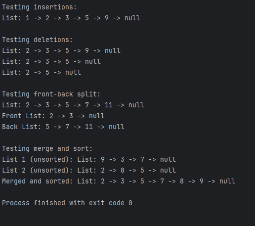

# Linked List Operations

This project implements a linked list data structure in Java with various operations including insertion, deletion, splitting, and merging.

## Features

### Insertion Operations
- Insert at the beginning
- Insert at the end
- Insert in sorted position

### Deletion Operations
- Delete first node
- Delete last node
- Delete node at specific index

### Split Operation
- Split a list into two sublists (front and back halves)
- For odd-length lists, the extra element goes to the front list

### Sort and Merge Operations
- Sort a linked list using merge sort
- Merge two sorted lists into one

## Implementation Details

The project consists of two main classes:

### Node Class
```java
class Node {
    int data;
    Node next;

    public Node(int data) {
        this.data = data;
        this.next = null;
    }
}
```

### LinkedList Class
Contains all operations for the linked list:
- Basic insertion and deletion methods
- `frontBackSplit()` - Uses the fast and slow pointer technique to find the middle
- `mergeAndSort()` - Sorts two lists independently and merges them
- `sort()` - Implements merge sort algorithm
- `display()` - Shows the list elements followed by "null" to indicate the end

## Usage Example

```java
LinkedList list = new LinkedList();

// Insertion
list.insertAtBeginning(1);
list.insertAtEnd(5);
list.insertSorted(3);

// Splitting
LinkedList[] splitLists = list.frontBackSplit();

// Merging
LinkedList merged = LinkedList.mergeAndSort(list1, list2);
```

## Algorithm Highlights

### Fast and Slow Pointer Technique
Used in the `frontBackSplit()` method to find the middle of the list:
- Fast pointer moves 2 nodes at a time
- Slow pointer moves 1 node at a time
- When fast reaches the end, slow is at the middle

This ensures that for odd-length lists like `{2, 3, 5, 7, 11}`, the split results in `{2, 3, 5}` and `{7, 11}`.

## Output Screenshot
